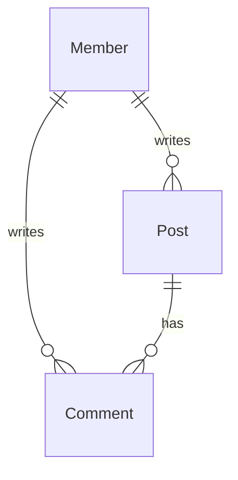

간단한 게시판 백엔드 프로젝트입니다.
======
REST API를 구현합니다.

---
### 사용된 기술
* Java 17
* SpringBoot 3.0
    - Spring Security + JWT
    - JPA
* MariaDB
* Git
---
### 구현할 기능
* 멤버
  * [x] 회원가입
  * [x] 정보수정
  * 로그인
    * [x] 액세스 토큰
    * [x] 리프레쉬 토큰
  * 로그아웃
    * [ ] 액세스 토큰 블랙리스트
    * [ ] 리프레쉬 토큰 삭제
  * [x] 회원 탈퇴

* 게시판
  * 게시글  
    * [x] 전체 게시글 보기
    * [x] 상세보기
    * [ ] 작성
    * [ ] 수정
    * [ ] 삭제
  * 댓글  
    * [ ] 작성
    * [ ] 수정
    * [ ] 삭제
---
### ER 다이어그램
